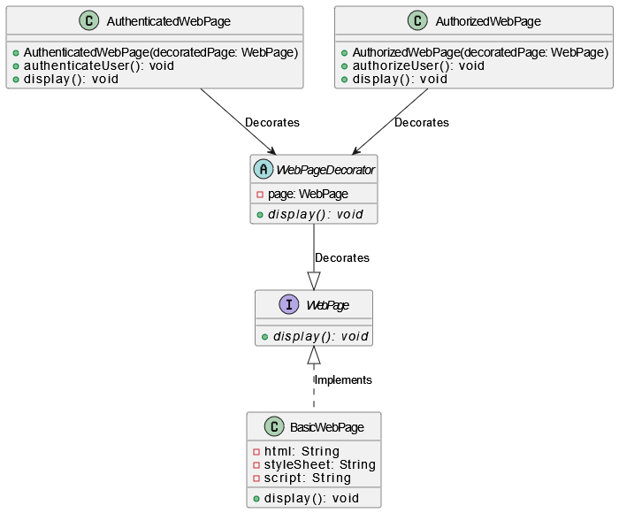

# Assignment 6

Implementation of a decorator design pattern by using an example
A web page might display complex behavior,
such as only allowing access to authorized users, or splitting
search results across multiple pages
# class diagram
